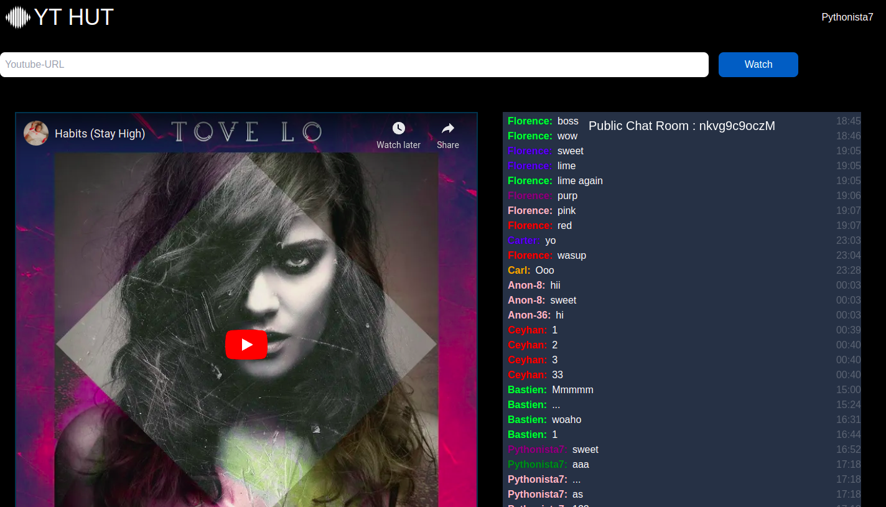

# Youtube Hut

Listen to music from Youtube and chat with everyone else watching the same video.

This is project is built with Next.js and Wundergraph and uses Github Authentication.There are also other 3rd party API's from `https://randomuser.me` and `https://api.chucknorris.io/` which help keep the chat box lively.



## Local Setup

1. Clone this repository.

2. Install dependencies with:

```sh
yarn
```

3. Signup for [mongodb-cloud](https://www.mongodb.com/cloud/atlas/register) and create a new project and a cluster. For the detailed mongodb-atlas setup see [here](#mongo-cloud-setup).

4. Setup a github oAuth app. For the detailed setup see [here](#setup-github-oauth-app).

5. Run the app

```sh
yarn start
```

## Mongo Cloud Setup

> All the services used are available under free-tier of mongo cloud.

1. Create a new project and a cluster.
2. Navigate into the cluster dashboard into the `Collections` tab.
3. Create a new collection named `Users` and add the following:
    *Note: set datatype of `verified` as boolean*

```json
{
    "color" : "lime",
    "name":"Pythonista7",
    "verified":true 
}
```

4. Create another Collection called public chat with the following:
    *Note: set datatype of `ts` as DateTime*

```json
{
    "color":"lime",
    "id":"nkvg9c9oczM",
    "msg":"sweet sweet rain.",
    "name":"Pythonista7",
    "ts": 2022-09-04T19:10:49.675+00:00
}
```

Once we have sample data mongo cloud lets us generate a graphql schema from the sample data and also provides us a graphql endpoint to query/mutate the data into mongodb.

5. Navigate to `App Services` and create a new app service.

6. Go into the dashboard of the new service and open `Data Access > Schema` tab, where you have an option to `Generate Schema` from existing data in the collection. Generate schema for both the created collections.They should look something like this:

```json
{
  "title": "PublicChat",
  "properties": {
    "_id": {
      "bsonType": "objectId"
    },
    "color": {
      "bsonType": "string"
    },
    "id": {
      "bsonType": "string"
    },
    "msg": {
      "bsonType": "string"
    },
    "name": {
      "bsonType": "string"
    },
    "ts": {
      "bsonType": "date"
    }
  }
}
```

```json
{
  "title": "User",
  "properties": {
    "_id": {
      "bsonType": "objectId"
    },
    "color": {
      "bsonType": "string"
    },
    "name": {
      "bsonType": "string"
    },
    "verified": {
      "bsonType": "bool"
    }
  }
}
```

7. IMPORTANT: Make sure you allow read and write roles to both the collections under `Data Access` > `Rules`.

8. Now we're all set to use a graphql endpoint. Head over to `Build` > `GraphQL` tab to try out the graphiql and copy the graphql endpoint and save to `MONGODB_ENDPOINT` in `.env` file.

9. Lastly to access this api we need to create a new user for this `App Service` by navigating to `Data Access` > `App Users` and creating a new user. This will give us an API key to use for authentication. Make sure you immediately save this key as it'll only be shown to you on creation. Add this api key to `MONGODB_APIKEY` in `.env` file.

10. MongoDB is now ready !

## Setup Github OAuth App

1. Go to <https://github.com/settings/applications/new>

2. Enter in your details and give the  `Authorization callback URL` as <http://localhost:9991/app/main/auth/cookie/callback/github> and generate the OAuth App.

4. Copy the client id and client secret and save them as `GITHUB_CLIENT_ID` and `GITHUB_CLIENT_SECRET` respectively in `.env` file.
